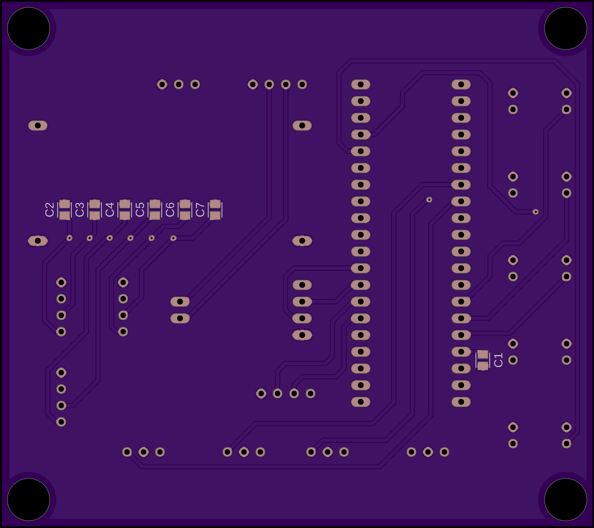
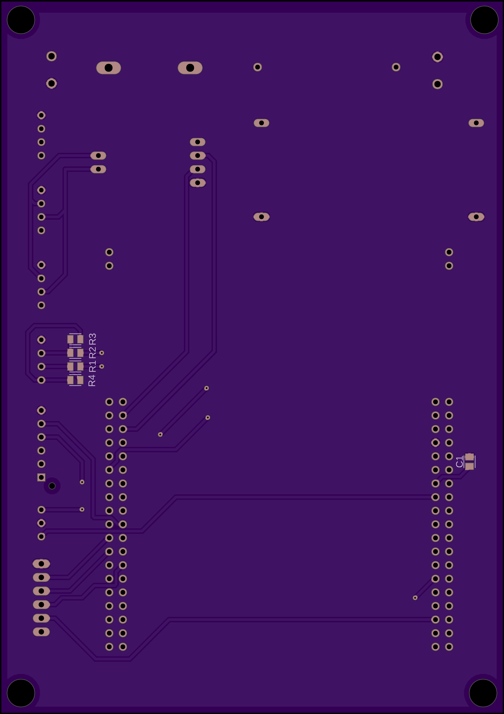
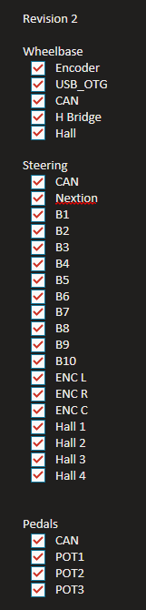

# Sim Racing System

Author: Samuel Swedberg

This Markdown file is a port from our OneNote design document from the semester. Please remember the context for this was for our professor for grading and progress.

Also remember that the is in chronological order. ECE 403 was the R&D phase and ECE 405 was the PCB phase. For example, in the R&D we used the L298N H bridge but eventually switched to a BTS7960B. Some of the hardware changes may have not been documented if it was during the PCB semester since we just wanted to finish.

Also converting this from OneNote to a markdown file is kinda annoying so a lot of the formatting might be messed up.

## Project Charter

The goal is to design a steering wheel, wheelbase, and pedals compatible with sim racing and automotive videogames. The steering wheel will be Formula 1 style with real-time telemetry data. The data will be shown through things such as a small screen and LEDs indicating rpm. User input will be received with various buttons and encoders. It will connect directly to the wheelbase, which will give force feedback response to the user. Pedals will connect to the wheelbase directly as well

### Project Description

Deliverables: Steering wheel, wheelbase, pedals

Key Elements: Force feedback wheelbase, Telemetry data from game displayed on wheel, pedal input measured by angle

Time Allocated: Two semesters

Budget: $300

### Tasks

| **Hardware Aspects** | **Software Aspects** | **Miscellaneous Aspects** |
|----------------------|----------------------|----------------------------|
| **Steering Wheel**   | **Steering Wheel**   | **All**                    |
| Leds                 | RPM Led customizable per vehicle | 3D print all physical enclosures and pieces |
| 4.3in LCD Display    | Controller-like inputs (Button0, Encoder0, etc) |                            |
| Buttons              | LCD Display          |                            |
| Encoders             |                      | **Steering Wheel (optional)** |
| Magnetic paddle shifters |                  | Carbon Fiber vinyl cover  |
| Spring clutch paddles|                      | Stickers for buttons and encoders |
| Connector to wheelbase |                    |                            |
|                      | **Wheelbase**        |                            |
| **Wheelbase**        | Force Feedback algorithm |                        |
| Motor                | Communication from PC to uC |                    |
| Motor encoder        | Communication from uC to pedals |               |
| Motor driver         | Communication from uC to steering wheel |        |
| uC                   |                      |                            |
| USB to PC            |                      |                            |
|                      | **Pedals**           |                            |
| **Pedals**           | Send position data to wheelbase |               |
| Encoder              |                      |                            |
| Connector to wheelbase |                    |                            |
|                      | **PC Application**   |                            |
|                      | Grab telemetry data from selected video game preset and send to wheelbase | |
|                      | Configuration for RPM limit and what each button does in game | |

Detailed descriptions corresponded with concept broken down into tasks

Example Structure:
Level 3 Activity
    - Task
        ○ Task details
    - Task

Hardware
    - DC motor (ECE 376) - Sam
    - Motor driver (ECE 376 or 320 or 321) - Sam
    - Power supply - Sam

PC Application - software
    - Receive telemetry data from video game - Sam
    - Send data to uC (ECE 376) - Sam
    - User configuration for LCD screen data and RPM gauge -Christian

Microcontroller C program for communication from PC to uC (ECE 376, CSCI 161)
    - Receive telemetry from PC and send to microcontroller for processing - Sam
    - Receive steering wheels inputs and send to PC -Christian
    - Force feedback algorithm to give instructions to DC motor (CSCI 161, maybe ECE 461) - Sam
    - C program will demonstrate use of modules and subroutines, and top down techniques (ECE 173, CSCI 161) - Both

LCD Display - software
    - Receive data from wheelbase (ECE 376)
    - Display parameters on screen (ECE 376)

Pedals - hardware and software
    - Encoder to measure pedal position (ECE 320) -Christian
    - Send position data to uC -Christian

Steering wheel - hardware
    - Mux for Buttons (ECE 275) -Christian
    - Encoders probably dedicated GPIO pin
    - Mux for RPM led array (ECE 275) -Christian
    - Paddle shifter switch probably dedicated GPIO pin
    - Clutch paddle switch probably dedicated GPIO pin
    - Send user input data to uC (ECE 376) -Christian
    - Receive user input data for display (ECE 376) -Christian

### Diagrams and Pinouts

## Sam's Section

### Tasks & Concepts

I am responsible for the wheelbase motors driving, microcontroller communication.

ECE Concepts
The the ECE concepts I have demonstrated as of 12/4/24 are:
    1. UART Communication (ECE 376) found in Task 1
    2. SPI Communication (ECE 376) found in Task 2
    3. Semaphores (CSCI 474) found in Task 2
    4. Driving a DC Motor using an H Bridge (ECE 376) found in Task 3
    5. C Programming techniques throughout entire project but highlighted in Task 4 (ECE 173, CSCI 161, ECE 376)
        ○ Top down, modules, subroutines, Data Structures
    6. Interrupts (ECE 376)
        ○ Found in DMA, SPI, UART protocol (Task 1 and 2)
    7. Timers (ECE 376)
        ○ Timer for rotary encoder (ECE 376 in Task 4)
            ○ Timer for PWM generation (ECE 376 in Task 3)

The ECE Tools I have used are an oscilloscope, logic analyzer, and a multimeter

My Tasks
PC App
    - Receive telemetry data from video game (task 1)
    - Send data to uC (task 1)
Microcontroller
    - uC data collection and processing (task 2)
    - FFB Code (task 4)
    - HID (task 5)
Hardware
    - Drive DC motor (task 3)
    - Power
Gantt Chart

### Task 1 - Telemetry Data + UART

Task Description:
We need a way to extract the data (gear, RPM, speed) from the video game(s) to send it to the microcontroller using UART to be processed.
ECE Concepts: UART (ECE 376)
Tools: n/a

Objective:
The STM needs to be able to transmit and receive data from the PC python program at real time speeds.

ECE CONCEPT: UART Communication from ECE 376 (Embedded Systems)

Paper Design:
See code diagram to the right as well

UART is a simple communication protocol in embedded systems used to transmit data. It is simple because it does not require a clock signal for synchronization, instead it uses start and stop bits to frame the data.

The reason we are using UART over other protocols is since for prototyping, I was able to use the STM debugger port as a serial port to send the telemetry data from the python program to the STM. We could pivot towards SPI however serial also is available in the composite driver so UART still works well for our use case. This was also the first communication protocol implemented so it was good to start with a less complex protocol.

Setting up UART was simpler than SPI in my opinion. I matched the baudrate at a standard baudrate of 115200 Bits/s. In my testing, I could faster baudrates, but for now I have stuck with this since it is sufficient for our use. If we take the bits per sec and translate that to Bytes we get 115200 bps / 8 bits per byte = 14400 Bps. This shows I have sufficient amount of space to send my telemetry JSON data.

In the STM I setup the UART mode as asynchronous and related parameters such as baudrate, word length, and stop bits. In the Python program, I utilized the serial library which opens a serial connection at the same baudrate over a COM port.

| Setting         | Value    |
|----------------|----------|
| Baudrate       | 115200   |
| Word Length    | 8 bits   |
| Parity         | None     |
| Stop Bits      | 1        |
| Data Direction | RX & TX  |

Matching these settings ensure compatibility and accurate data transfer.

The way I received telemetry data from Assetto Corsa (AC) was through a library that utilizes a method that AC supports called Shared Memory. This method accesses kernel data from AC in real time, quite faster than through a UDP port which I did test as well. I had to download and modify the library since it did not include some parameters that I would like to display.

Analysis:
Code for STM and PC Python

Simulation:
Youtube demo: [YT link](https://www.youtube.com/watch?v=evcsoBCkEmo)
In the video you can see that when the car values change (rpm, kph) in game, the output reflects that UART is working successfully. For example, you can see the rpm on the left side of the console being printed out and up to date with the in game value.

This is done through the STM USB port. There are no pinouts diagrams or breadboard required.
Sim wheel telemetry using accsharedmemory
Samuel Swedberg

Breadboard:
n/a since just USB port on STM dev board.

Comments:
This task is complete.
My ability to use UART communication was demonstrated. The results show that I am able to send data successfully and accurately between the PC and STM.

The video below shows the verification that the UART is transmitting correctly

### Task 2 - Microcontroller SPI Communication

Task Description:
Once we got telemetry data we need to send it from the PC application to the microcontroller. The STM is the master and the picos are the slave controllers and they will communicate using SPI
ECE Concepts: SPI (ECE 376); Semaphores (CSCI 474)
Tools: oscope, logic analyzer

Objective:
The microcontrollers need to be able to transmit and receive data from each other at real time speeds.

ECE CONCEPT: SPI Communication from ECE 376 (Embedded Systems)

Paper Design:
Functions that relate to this task (which can be found in main.c and freertos.c):
MX_USART2_Init
    - Initializes UART protocol
MX_SPI2_Init
    - Initializes SPI Protocol
StartTelemetryTask
    - Main UART Task Code
StartSPISend
    - Main SPI Task Code
process_command
    - Parses telemetry data from a JSON received over UART, sets telemetry struct values from parsed data

See code diagram to the right as well

For this concept I was able to get the STM and the Pico to communicate over SPI protocol.

The reason we decided to use SPI since it would support sending our telemetry data and user input at a very quick rate since we wanted our data to be real-time. SPI is useful since the clock signal synchronizes the microcontrollers and along with a chip select line to select which chip you want to communicate with which will be useful for the steering wheel pico and the pedal pico. This also is an advantage over other protocols like UART since I can specifically select the individual devices.

We setup the STM as the master controller and the Pico as the slave controller. SPI uses four signals: a clock signal (SCK), data lines (MOSI/MISO), and a chip select (CS). Along with this we had to have matching parameters between the STM and the Pico in order for correct data transfer. The baud rate (configured by a prescalar) can be configured to be as fast as we want as long as it is still compatible. We found the Pico would have issues above 656.25 Kbits/s, which is plenty fast for our use case. However between the two controllers, clock polarity (CPOL) and clock phase (CPHA) has to match. We selected low clock polarity and 1 edge as our clock phase. Here is a table representing our parameters:

| Setting     | Value           |
|-------------|-----------------|
| Data Size   | 8 Bits          |
| First Bit   | MSB             |
| Prescalar   | 64              |
| Baudrate    | 656.25 Kbits/s  |
| CPOL        | Low             |
| CPHA        | 1 Edge          |

The math behind how the baudrate is set from the prescalar is the following:
System clock frequency = 42 MHz
Prescalar = 64
42 MHz / 64 = 656.25 kHz or Kbits/s

The ways I tested if SPI was being transmitted correctly was by sending 0xAA (10). This is a good test byte to send because if the clock polarity or clock phase was incorrect the data would come back reversed as 0x55 (01). From there we send our struct with hard coded variables to verify the struct would stay in order, which it did with correct settings. I verified this through the oscilloscope debug function, using a logic analyzer, and finally printing out the byte values on the Pico serial terminal.

Analysis:
Code for STM and Pico

Simulation:
Below is the sample struct data used to communicate between the two.

Example data used to test and verify SPI communication

| Field       | Value | Hex Value (little-endian) |
|-------------|--------|---------------------------|
| tRpm        | 3600   | 10 0E 00 00               |
| tGear       | 1      | 01 00 00 00               |
| tSpeedKmh   | 120    | 78 00 00 00               |
| tHasDRS     | 0      | 00 00 00 00               |
| tDrs        | 0      | 00 00 00 00               |
| tPitLim     | 0      | 00 00 00 00               |
| tFuel       | 45     | 2D 00 00 00               |
| tBrakeBias  | 0      | 00 00 00 00               |
| tForceFB    | 1      | 01 00 00 00               |

Oscilloscope:

Baudrate at this time was set to 328.125 Kbits/s with a prescarlar of 128.
Frequency % error is 0.876%, which is most likely due to breadboard grounding.
However duty cycle at 50% exactly is perfect

Through the S1 line at the bottom, you can see that the hex values match up with the data table above.

Logic Analyzer:

D0 is master data, D1 is clock, D2 is chip select. Once I set the logic analyzer decode to SPI this is the result I received.

This matches the hex data perfectly as seen in the oscilloscope as well.

Pico serial:

In the serial terminal I printed out the data as bytes and also the data put into our struct on the Pico side.

This shows the Pico received the data successfully along with the oscilloscope and logic analyzer verification.

Breadboard results:

Signals:

- MOSI (master out slave in): green cable
- MISO (master in slave out): not used in this case
- SCK (clock): orange cable
- CS (chip select): yellow cable
- GND: black cable

ECE CONCEPT: Semaphore from CSCI 474 (Operating System Concepts)

Paper Design:
Since we are utilizing a real time operating system to (FreeRTOS) to schedule tasks, we have access to semaphores.

A semaphore is a synchronization method used in concurrent programming to control access to resources shared by multiple tasks. A good way to think about this in our use case is a flag to signal if the resource is available. For this we set the counter to 1 which means one task can use this resource. The main functions you can used with a semaphore are:
    - Take signal which takes the counter down to 0 to show that the resource is being used
    - Give signal which releases the semaphore incrementing the counter back to 1 to show it is free to use.

The reason I wanted to use a semaphore is for the DMA (direct memory access) controller. DMA is a method that allows the peripheral to transfer data from memory with involving the CPU which frees the CPU to perform other tasks. The critical issue I saw was the SPI would give the transmit signal before the DMA transfer was complete with lead to a deadlock. By using a semaphore this allowed the SPI transfer to only occur once the DMA transfer was complete.

The control flow looks like this:
    1. The SPI Task would start by attempting to take from the semaphore.
    2. If the semaphore is free, it will lock it and send an SPI transfer and signal and interrupt to the DMA controller to begin data transfer.
    3. The SPI Task loops back but is blocked until the semaphore is available again, ensuring no overlap between SPI transfers.
    4. Once the DMA transfer is complete the semaphore is released and the SPI Task is free to take the semaphore and repeat the cycle.

Another useful future case for this will be multiple device SPI transfer. Once we implement the pico for the pedals we will be able to signal the SPI transfer for the steering wheel and the CPU will be able to move on to signaling the pedal SPI transfer while DMA takes care of reading the memory.

Analysis:
Code is to the right (check for the red text)

No breadboard necessary since this is a pure software concept. And since SPI is working correctly that is showing the semaphore implementation is working

Comments:
This task is complete.
My ability to use SPI communication was demonstrated. The results show that I am able to send data successfully and accurately between the STM and Pico(s).
My ability to use semaphores was demonstrated. I was able to keep the DMA interrupt from entering a deadlock.

### Task 3 - Drive DC Motor

Task Description:
We need to be able to give commands to the motor and the motor respond accordingly
ECE Concepts: Drive a DC motor using H Bridge (ECE 376), Timer (ECE 376), C Programming
Tools: oscope & meter

Objective:
In our force feedback system, the H-bridge is used to drive the motor that simulates resistance or force on the steering wheel. By dynamically adjusting the PWM duty cycle and direction based on the force feedback calculations, we can replicate realistic driving forces and conditions.

ECE CONCEPT: Drive DC Motor using H Bridge (Embedded Systems)

Paper Design:
Functions that relate to this task:
StartFFBTask
    - Main FFB Task Code

Motor Control Functions:
    Set_motor_pwm
        ○ Converts PWM value to timer compare register value
    Set_motor_direction
        ○ Sets GPIO pins to the H bridge to determine motor's rotation direction

The reason we are using an H Bridge since it allows us to rotate the motor by closing switches in specific patterns. An H Bridge supports rotating the motor forward, reverse, stopping, or braking if desired.

The way I controlled the H Bridge was through 3 GPIOs from the STM: IN1, IN2, and PWM. IN1 & IN2 are set high and low and determine the direction of the motor spinning. PWM is configured to generate a PWM signal through a timer.

Below is the code for how the motor direction is set:

Below is how the motor pwm is set through the timer:

These functions are called by the FFB Code found in Task 4.

Analysis:
Code for STM and Pico is to the right

Simulation:
YouTube demo:
Note: The motor is being used as a resistant force. The farther I am turning it, the harder it is resisting against my force. For this verification, I have a function that increases resistance the farther I turn from the zero point. The PWM signal increasing when I turn and decreasing when I slowly turn back to zero shows that the H bridge and STM is working correctly.

[Driving DC Motor with H Bridge YT Demo](https://www.youtube.com/watch?v=lNWgNx6d43k)
[Torque Resistance YT Demo](https://www.youtube.com/shorts/Dp8jKzaU7sc)

Breadboard results for both concepts:
Overall system:

L298N H bridge:

Input:

- 5V logic (orange cable)
- 33V for motor drive (red cable)
- PWM Signal (green cable)
- IN1 Direction (white cable)
- IN2 Direction (black cable)
- GND (blue cable)

Output:

- (+) motor drive (red output cable)
- (-) motor drive (black output cable)

Relationship:

- When IN1 is high, turn left
- When IN2 is high, turn right
- When both are low, stop
- PWM Signal is set from 0-255, where the higher the value, the faster the motor will spin

All voltages and signals were verified in the YouTube demo

STM Pinouts

ECE CONCEPT: Timer (Embedded Systems)

Paper Design:
A timer is a hardware peripheral in embedded systems that counts clock cycles to measure time or generate precise time-based events. Timers are critical for tasks that require precise control or measurement, such as delays, signal generation, or frequency counting.

The reason I am using a timer is since this is a simple way to generate a PWM signal. I used the STM's third timer for this function, and set it to PWM mode and set the parameters up the following way:

| Setting      | Value   |
|--------------|---------|
| Prescalar    |         |
| Counter      | Up      |
| Period       | 1000-1  |
| CKD          | No      |
| Mode         | PWM     |
| Pulse        | 500     |
| CH Polarity  | High    |

The timer is utilized in the code above for set_motor_pwm.

Analysis:
Code

Simulation:
Shown in YT demo above through the PWM signal changing

Breadboard:
Look above shown through PWM signal pinout.

Comments:
This task is complete.
My ability to use an H Bridge as a motor driver was demonstrated. The results through the video shows that when I increased the PWM the motor would spin (or in this case increase resistant torque), and also switch direction based on encoder direction.
My ability to use a timer was demonstrated. The results show that a PWM signal is successfully generated.

### Task 4 - Force Feedback

Task Description:
Take the -1 to 1 signal from the game and translate that into something that makes sense to the motor, example is PWM from 0 to 255 and other parameters to fine tune the PWM distribution.
ECE Concepts: C programming, Timer (ECE 376)
Tools: n/a

Objective:
Takes the force feedback signal from the game, usually a value between -1 and 1, and translates it into motor commands for the wheel. It scales the signal to adjust the intensity, determines the direction based on whether the signal is positive or negative, and then generates motor commands like PWM duty cycles or torque values. The goal is to replicate realistic forces, like road feedback or steering resistance, so the wheel responds accurately to what’s happening in the game. I also included safeguards to limit torque and smooth out the response to keep everything controlled and reliable.

ECE CONCEPT: C Programming/Subroutines/Functions (ECE 376)

Paper Design:
Functions that relate to this task:
StartFFBTask
    - Main FFB Task Code

Physics Functions:
    Calculate_inertia
        ○ Models the inertia effect for the steering wheel and smoothens the applied force. Adds realism to the force feedback.
    Calculate_damping
        ○ Calculates damping force proportional to angular velocity, or a negative force to velocity.
    Calculate_friction
        ○ Simulates constant opposing force based on direction. Also stabilizes when no motion is present.
    Calculate_lock
        ○ Applies a strong resistant force if wheel angle exceeds maximum range, prevented excessive rotation.
    Scale_to_pwm
        ○ Covnerts FFB signal to a PWM signal for the motor.

Encoder Functions:
    Init_encoder
        ○ Initializes encoder timer
    Read_encoder_position
        ○ Reads current position
    Reset_encoder_position
        ○ Resets count to zero
    Get_angle_degrees
        ○ Converts encoder count to steering angle in degrees

Motor Control Functions:
    Update_wheel_position_and_velocity
        ○ Calculates steering wheel's angle and angular velocity based on encoder.
    Set_motor_pwm
        ○ Converts PWM value to timer compare register value
    Set_motor_direction
        ○ Sets GPIO pins to the H bridge to determine motor's rotation direction

Analysis:
Code

Simulation & Results:
YouTube demos from Task 3
Additional demo: [STM as a controller works in game](https://www.youtube.com/watch?v=tFj4S_4a7LA)

ECE CONCEPT: Timer (Embedded Systems)

Paper Design:
A timer is a hardware peripheral in embedded systems that counts clock cycles to measure time or generate precise time-based events. Timers are critical for tasks that require precise control or measurement, such as delays, signal generation, or frequency counting.

The reason I am using a timer for encoder tracking since STM supports a timer mode that combines both encoder signals to increment a counter. I set up the parameters as the following:

| Setting     | Value      |
|-------------|------------|
| Prescalar   | 0          |
| Counter     | Up         |
| Period      | 4294967295 |
| CKD         | No         |
| Mode        | Encoder    |
| Polarity    | Rising     |

Each tick of the encoder signal that the STM receives, it is set to increment or decrement the timer's counter. I then take this number and do math functions to convert into degrees of rotation for the other motor control and physics functions to utilize.

Analysis:
Code

Simulation:
See YT Demo videos from above

Breadboard results for both concepts:
Overall system:

Encoder wiring:
    Inputs: 5V, GND
    Output: Signal A (IN1) , Signal B (IN2)

Comments:
This task is complete.
My ability to use a timer was demonstrated. The results show that the rising edges of the encoder signals are successfully read and analyzed into rotation in degrees.

### Task 5 - Game Controller USB Composite Device

Description: Have the computer recognize the STM32 as a controller to be able to give inputs to video games
ECE Concepts: C Programming
Tools: n/a

Objective:
I'm using a USB composite device to handle the game controller functionality, allowing the wheelbase to act as multiple devices over a single USB connection. I can streamline the connection to the PC without needing multiple physical USB connections.

This section will not include any concepts from any NDSU ECE class besides C programming, however this is something we needed to achieve in order to successfully get a game controller working.

The STM supports USB on-the-go (OTG), which allowed me to connected D+ and D- pins to a USB breakout board and connect it to the computer. The computer then recognizes it as a virtual com port (CDC) for UART communication and as a human interface device (HID) to be recognized as a game controller. The correct term for this is a USB composite device since there are more than one protocol.

Functions that relate:
StartHIDTask
    - Main HID Task Code

### ECE Tools

ECE Tools used in which tasks
Oscilloscope: Task 2, Task 3
Logic Analyzer: Task 2
Multimeter: Task 3

## 405 Charter

### Gantt Chart

## Breadboard

### Schematics

Block Diagram

### Photos

### Testing

### Parts List

Wheelbase:
1x STM32F446
1x DC-DC 36V/24V -> 5V Converter
1x CAN Bus Transceiver
1x H-Bridge
1x Hall Sensor
1x Rotary Encoder
2x 220Ω resistors
3x USB Breakout Port
1x 100uF capacitor (reset)
1x 10A Fuse
1x Schottky Diode (RP)

Steering wheel:
1x STM32F103
1x DC-DC 36V/24V -> 5V Converter
1x CAN Bus Transceiver
4x Hall Sensor
10x Buttons
3x Rotary Switch Encoders
1x Neopixel array
1x USB Breakout Port
1x 100uF capacitor (reset)
6x 100nF capacitor (encoders clk and dt)
1x Schottky Diode (RP)

Pedals:
1x STM32F103
1x DC-DC 36V/24V -> 5V Converter
1x CAN Bus Transceivers
3x Potentiometers
1x USB Breakout Port
1x 100uF capacitor (reset)
1x Schottky Diode (RP)

Misc:
3x USB Cables

## Software

### Flow Charts

CAN Messages

Wheelbase:
0x100 - rpm
0x101 - gear
0x102 - speedKmh
0x103 - hasDrs
0x104 - drs
0x105 - pitLim
0x106 - fuel
0x107 - brakeBias
0x108 - maxRpm
0x109 - forceFB

Steering Wheel:
0x200 - buttons
0x201 - hall analog 1
0x202 - hall analog 2

Pedals:
0x300 - encoder 1
0x301 - encoder 2
0x302 - encoder 2

### Software Testing

## PCB

### Schematics - Rev 1

### PCB Layout - Rev 1

### PCB Photos - Rev 1

Refer to rev 2

### PCB Testing - Rev 1

### Schematics - Rev 2

### PCB Layout - Rev 2

### PCB Photos - Rev 2

[Sim Racing System PCB Telemetry](https://www.youtube.com/shorts/dFbHP5ISzgE)
[Sim Racing System Power Up](https://youtube.com/shorts/agtKgb01q2g)

### PCB Testing - Rev 2

## Final Report

### Packaging

Packaging is done through 3D printing

Wheelbase has an aluminum extrusion frame and 3D printed panels
Steering Wheel is 3D printed
Pedals are 3D printed

### Packaged Test Results

### Packaged Photos

### Poster

### 2 Minute Demo Video

[NDSU Senior Design Demonstration | Sim Racing System](https://www.youtube.com/watch?v=K_I2sCAWH18)

## Final Comments

If you are reading this at the bottom, thank you. This project means a lot to Christian and I. If you have any questions feel free to reach out to me on my [LinkedIn](https://www.linkedin.com/in/samuel-swedberg/)

Here are some photos of the event day

